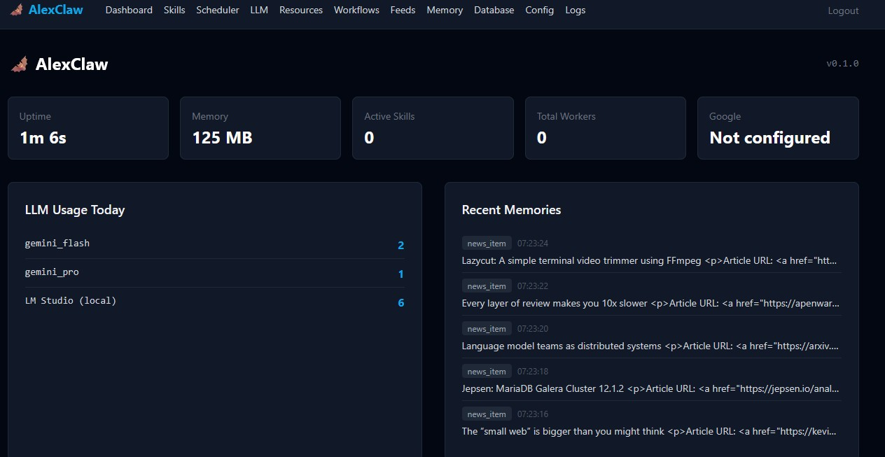
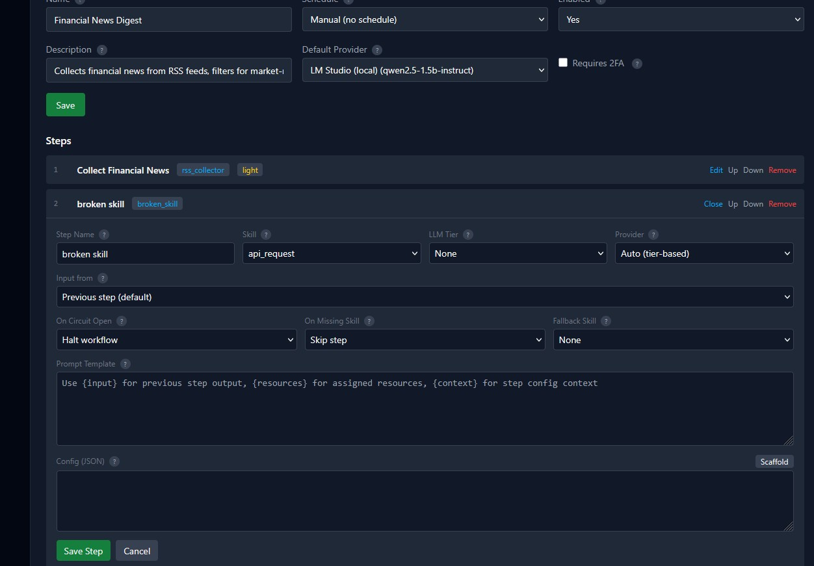
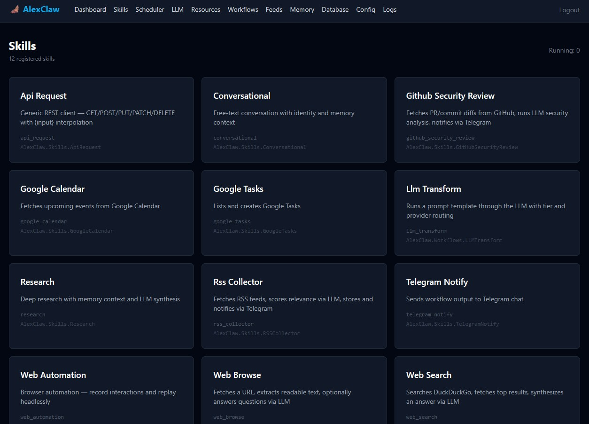
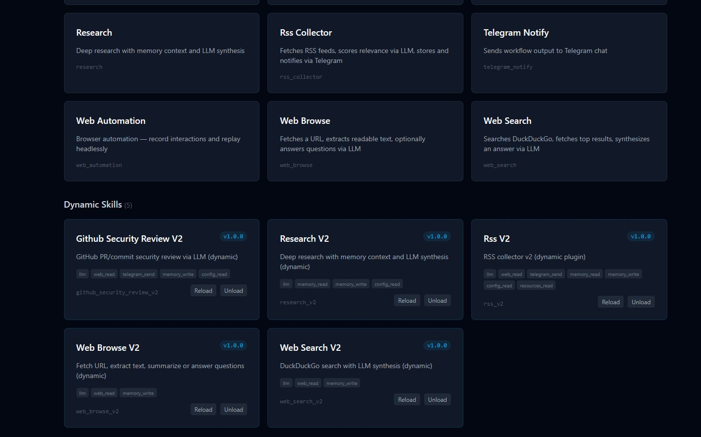
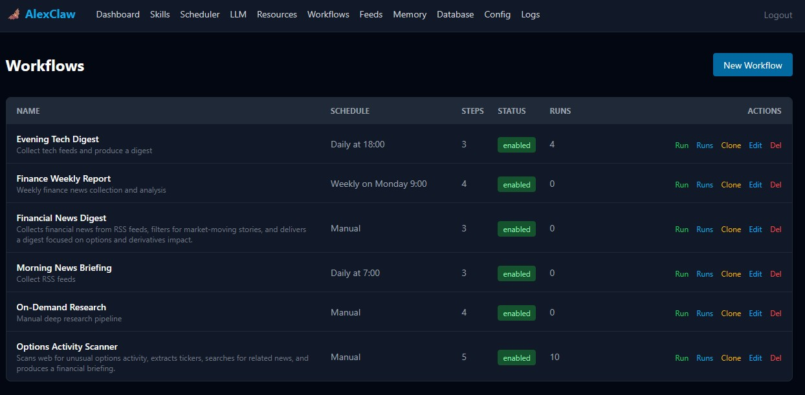

# AlexClaw 🦇

A BEAM-native personal autonomous AI agent built on Elixir/OTP.

AlexClaw monitors the world (RSS feeds, web sources, GitHub repositories, APIs), accumulates knowledge, executes workflows autonomously on schedule, and communicates with its owner via Telegram. It routes every task to the cheapest available LLM that satisfies the required reasoning tier — including fully local models.

> **Designed as a single-user personal agent.** Not a platform. Not a marketplace. One codebase, fully auditable, running on your infrastructure.

"I didn't plan most of this. I just kept solving the next problem."



---

## Features

### Core

- **Multi-Model LLM Router** — Tier-based routing (`light` / `medium` / `heavy` / `local`) with priority-based selection. All providers (cloud and local) are stored in PostgreSQL and fully manageable from the admin UI. Tracks daily usage per provider in ETS. Ships with default providers (Gemini, Claude, Ollama, LM Studio) seeded on first boot — add, remove, or reconfigure any provider at runtime.
- **Workflow Engine** — Define multi-step pipelines with conditional branching. Each skill declares its possible outcomes (branches), and the executor routes to different steps based on which branch fires. Per-step resilience controls (circuit breaker, missing skill handling, fallback routing). Zero LLM tokens spent on routing — pure deterministic pattern matching. Full run history with branch path visualization.
- **OTP Circuit Breaker** — Per-skill circuit breaker using GenServer + ETS. After consecutive failures a skill is temporarily disabled (circuit open), then automatically re-tested after a cooldown. Telegram notifications on state transitions. Dead letter routing: workflow steps can skip, halt, or fallback to an alternative skill when a circuit is open or a skill is missing. Zero external dependencies — pure OTP.


- **Telegram Gateway** — Bidirectional communication via long-polling. Command routing is deterministic pattern-matching — no LLM involved in dispatch.
- **Runtime Configuration** — All settings (API keys, prompts, limits, personas) are stored in PostgreSQL, cached in ETS, and editable at runtime via the admin UI. No restart required for any config change.
- **Persistent Memory with Semantic Search** — PostgreSQL + pgvector for knowledge storage. Deduplication by URL. Hybrid search combines vector cosine similarity and keyword matching — vector results are prioritized, keyword results fill gaps for exact matches. Embeddings are generated asynchronously via the LLM router (Gemini `gemini-embedding-001`, Ollama `nomic-embed-text`, or any OpenAI-compatible endpoint). 768-dimension vectors with HNSW index. All skills that store knowledge auto-embed in the background.
- **Cron Scheduler** — Quantum-based. Jobs defined in config or DB.

### Skills



| Skill | Description |
|---|---|
| `rss_collector` | Fetch RSS feeds, deduplicate, score relevance via LLM, notify. Configurable fetch timeout (global + per-step) |
| `web_search` | Search the web and synthesize answers |
| `web_browse` | Fetch and summarize a URL, or answer questions about it |
| `research` | Deep research with memory context |
| `conversational` | Free-text LLM conversation |
| `telegram_notify` | Send a Telegram message as a workflow step |
| `llm_transform` | Run a prompt template through the LLM (workflow glue step) |
| `api_request` | Make an authenticated HTTP request |
| `github_security_review` | Fetch PR/commit diff, run LLM security analysis |
| `google_calendar` | Fetch upcoming Google Calendar events |
| `google_tasks` | Manage Google Tasks lists and items |
| `web_automation` | Browser automation via headless Playwright sidecar (**experimental**) |

### Dynamic Skill Loading (**experimental**)



> **This feature is under heavy development.** The API, permission model, and sandboxing may change without notice.

Load custom skills at runtime — no code changes, no Docker rebuild, no restart. Drop an `.ex` file into the skills volume (or upload via the admin UI), and it compiles into the running VM immediately.

- **Permission sandbox** — Dynamic skills declare permissions (`llm`, `web_read`, `telegram_send`, `memory_read`, `memory_write`, `config_read`, `resources_read`, `skill_invoke`) and interact through `SkillAPI` only. Undeclared permissions are denied at runtime.
- **Namespace enforcement** — Module must be `AlexClaw.Skills.Dynamic.*`
- **Integrity verification** — SHA256 checksum stored on load, verified on boot. Tampered files are skipped with a Telegram alert.
- **Persistence** — Dynamic skills survive container restarts (DB + Docker volume)
- **Admin UI** — Upload, reload, and unload skills from the Skills page. Core and dynamic skills are shown separately.
- **Telegram commands** — `/skill load`, `/skill unload`, `/skill reload`, `/skill create`, `/skill list`
- **Cross-skill invocation** — Dynamic skills can call other skills (core or dynamic) through `SkillAPI.run_skill/3`
- **Conditional branching** — Dynamic skills can declare `routes/0` (e.g. `[:on_results, :on_empty, :on_error]`) and return triple tuples `{:ok, result, :branch_name}` for workflow routing. Routes are persisted in the database on load and cleaned up on unload — same behavior as core skills.

#### Permissions

| Permission | Grants access to |
|---|---|
| `:llm` | LLM completion, system prompt |
| `:web_read` | HTTP GET, POST, and arbitrary requests |
| `:telegram_send` | Send Markdown or HTML messages to Telegram |
| `:memory_read` | Search, check existence, list recent memories |
| `:memory_write` | Store new memory entries |
| `:config_read` | Read runtime config values |
| `:resources_read` | List and fetch resources |
| `:skill_invoke` | Call other skills by name |

#### Getting Started

See [`test/fixtures/skills/skill_template.ex`](test/fixtures/skills/skill_template.ex) for a fully documented template with the complete SkillAPI reference. Dynamic skill examples (RSS with full article fetching, NVD CVE Monitor, Research, GitHub Review, Web Search, Web Browse) are available in the same directory.

### GitHub Security Review

AlexClaw can review pull requests and commits for security issues:

- Run as a workflow step with per-workflow repo, token, and security focus
- Trigger manually via Telegram: `/github pr owner/repo 42`
- GitHub webhook endpoint available (`/webhooks/github`) with HMAC-SHA256 verification
- Diff truncation at 24KB — works with local models
- Structured output: RISK LEVEL, FINDINGS, SUMMARY, RECOMMENDATION

### Security

- **Session-based authentication** — all routes except `/login` require an authenticated session
- **Two-Factor Authentication (2FA)** — TOTP-based via authenticator apps. Setup and confirmation via Telegram (`/setup 2fa`, `/confirm 2fa`)
- **Built-in login rate limiting** — ETS-based, configurable max attempts and block duration, adjustable at runtime without restart
- **HMAC-SHA256 webhook verification** — GitHub webhook endpoint uses `Plug.Crypto.secure_compare` for timing-safe signature validation
- **Encryption at rest** — API keys and tokens are AES-256-GCM encrypted in PostgreSQL, decrypted transparently at runtime
- **Sensitive key masking** — API keys and tokens show partial values in the admin UI

---

## Architecture

```
Telegram <──> Gateway <──> Dispatcher ──> Skills
                                │
Admin UI (Chat) ──────> SkillSupervisor ──> Dynamic Skills
                       (DynamicSupervisor)
                                │
                 ┌──────────────┼──────────────┐
              RSS            Research        NVD CVE
             Skill            Skill         Monitor
                                │
                           LLM Router
                    (Gemini / Anthropic / Ollama / LM Studio)
                                │
                    ┌───────────┴───────────┐
                 Memory                  Config
          (pgvector + embeddings)    (DB + ETS + PubSub)
           ↑ semantic search ↑

GitHub Webhook ──> WebhookController ──> GitHubSecurityReview
Scheduler (Quantum) ──> Workflows.Executor ──┬──> CircuitBreaker ──> Skills ──> Branch Router
Phoenix LiveView Admin ──> all of the above  └──> Fallback / Skip / Halt    └──> Next Step
```

Every skill runs as an isolated OTP process. Crashes are contained and supervised. The circuit breaker wraps each skill transparently — skills have zero awareness of it. The `Dispatcher` is deterministic pattern-matching — no LLM token cost for routing.

See [ALEXCLAW_ARCHITECTURE.md](ALEXCLAW_ARCHITECTURE.md) for the full design document.

---

## Quick Start

```bash
git clone https://github.com/thatsme/AlexClaw.git
cd AlexClaw
cp .env.example .env
# Edit .env — set DATABASE_PASSWORD, SECRET_KEY_BASE, ADMIN_PASSWORD,
# TELEGRAM_BOT_TOKEN, TELEGRAM_CHAT_ID, and at least one LLM API key
docker compose up -d
```

Open [http://localhost:5001](http://localhost:5001) and log in with your `ADMIN_PASSWORD`.
Send `/ping` to your Telegram bot to verify connectivity.

For detailed setup instructions, Telegram bot setup, and local model configuration, see **[INSTALLATION.md](INSTALLATION.md)**.

---

## Configuration

All configuration is managed at runtime through the admin UI (`/config`). On first boot, values are seeded from environment variables. After that, changes are made in the UI — no restart needed.

### Minimum required environment variables

| Variable | Description |
|---|---|
| `DATABASE_PASSWORD` | PostgreSQL password |
| `SECRET_KEY_BASE` | Phoenix session secret (`mix phx.gen.secret`) |
| `ADMIN_PASSWORD` | Web interface login password |
| `TELEGRAM_BOT_TOKEN` | From @BotFather |
| `TELEGRAM_CHAT_ID` | Your Telegram chat ID |

### LLM providers (at least one required)

| Variable | Description |
|---|---|
| `GEMINI_API_KEY` | Google Gemini (free tier available) |
| `ANTHROPIC_API_KEY` | Anthropic Claude |
| `OLLAMA_ENABLED=true` + `OLLAMA_HOST` | Local Ollama instance |
| `LMSTUDIO_ENABLED=true` + `LMSTUDIO_HOST` | Local LM Studio instance |

All other settings (GitHub tokens, webhook secrets, LLM limits, prompts, skill config) are managed at runtime through the Config UI after first boot.

See `.env.example` for the full list of bootstrap variables.

---

## LLM Tier System

| Tier | Default providers | Typical use |
|---|---|---|
| `light` | Gemini Flash, Claude Haiku | RSS scoring, classification, simple tasks |
| `medium` | Gemini Pro, Claude Sonnet | Summarization, research, security review |
| `heavy` | Claude Opus | Deep reasoning (explicit only) |
| `local` | LM Studio, Ollama | Privacy-sensitive content, offline use, zero cost |

All providers live in the database and can be added, removed, or reconfigured from the admin UI. The defaults above are seeded on first boot. The router selects by priority within each tier (lower priority number = preferred), tracks daily usage, and falls back to the next available provider. A fully local deployment with no API keys is supported — enable a local provider and all tiers will fall back to it.

---

## Telegram Commands

| Command | Description |
|---|---|
| `/ping` | Check if the bot is alive |
| `/status` | System status (uptime, memory, active skills) |
| `/skills` | List registered skills (core + dynamic) |
| `/skill load <file>` | Compile and register a dynamic skill |
| `/skill unload <name>` | Remove a dynamic skill |
| `/skill reload <name>` | Recompile a dynamic skill |
| `/skill create <name>` | Generate a skill template file |
| `/llm` | Show LLM provider status |
| `/workflows` | List all workflows with status and ID |
| `/run <id or name>` | Run a workflow on demand |
| `/research <query>` | Deep research with memory context |
| `/search <query>` | Web search and synthesis |
| `/web <url>` | Fetch and summarize a URL |
| `/web <url> <question>` | Answer a question about a URL |
| `/github pr <owner/repo> [number]` | Security review a PR |
| `/github commit <owner/repo> <sha>` | Security review a commit |
| `/events` | Show today's Google Calendar events |
| `/events add <title> <date> <time>` | Create a calendar event |
| `/tasks` | List Google Tasks |
| `/tasklists` | List your task lists by name |
| `/task add <title>` | Add a task to Google Tasks |
| `/record <url>` | Start browser recording session (web-automator) |
| `/record stop <session_id>` | Stop a recording session |
| `/automations` | List automation resources |
| `/setup 2fa` | Set up two-factor authentication |
| `/confirm 2fa <code>` | Confirm 2FA with authenticator code |
| `/google auth` | Start Google OAuth flow via Telegram |
| `/help` | Show all commands |
| _any text_ | Free-text conversation |

---

## Admin UI



| Page | Description |
|---|---|
| Dashboard | System status, recent activity |
| Chat | Interactive conversation with semantic memory search — pick any provider (cloud or local) |
| Skills | Core and dynamic skills — upload, reload, unload |
| Scheduler | Cron jobs and scheduled workflows |
| LLM | Provider status and usage |
| Workflows | Create/edit/run multi-step pipelines, view run history |
| Feeds | RSS feed management |
| Resources | Shared resources for workflows |
| Memory | Browse and search stored knowledge |
| Database | Schema browser and backup download |
| Config | Runtime configuration editor |
| Logs | Real-time log viewer with severity filtering |

---

## Project Structure

```
lib/
  alex_claw/
    config/          # Runtime config (DB + ETS + PubSub broadcast)
    llm/             # LLM router, usage tracker, provider schema
    memory/          # Memory entry schema
    skills/          # Core skill modules, SkillAPI, DynamicSkill schema, CircuitBreaker
    workflows/       # Executor, scheduler sync, SkillRegistry (GenServer+ETS), step/run schemas
    dispatcher.ex    # Deterministic message routing
    gateway.ex       # Telegram bot
    identity.ex      # Agent persona and system prompts
    llm.ex           # Multi-model router
    memory.ex        # Knowledge store
    rate_limiter.ex  # ETS-based login rate limiting
    scheduler.ex     # Quantum cron scheduler
  alex_claw_web/
    controllers/     # Auth, database backup, GitHub webhook
    live/admin_live/ # LiveView admin pages (12 pages including Chat)
    plugs/           # RequireAuth, RateLimit, RawBodyReader
priv/repo/
  migrations/        # All DB migrations
  seeds/             # Example workflow seeds
```

---

## Known Limitations

- **Semantic search requires an embedding provider.** Vector search works when at least one embedding-capable provider is configured (Gemini, Ollama, or OpenAI-compatible). Without one, memory falls back to keyword search. Configure via `embedding.provider` and `embedding.model` in the admin UI.
- **Single-user only.** There is no multi-user access control. The authentication model assumes one trusted operator.
- **Sensitive config encrypted at rest.** API keys and tokens are AES-256-GCM encrypted in PostgreSQL using `SECRET_KEY_BASE` as key material. Changing `SECRET_KEY_BASE` requires re-entering all API keys. See [SECURITY.md](SECURITY.md) for details.
- **Web Automator is experimental.** The browser automation sidecar (`web_automation` skill) is under heavy development. APIs, config format, and recording workflow may change without notice.

---

## Code Intelligence Reports

AST-level analysis reports generated by [Giulia](https://github.com/thatsme/Giulia) — heatmap zones, change risk, blast radius, coupling analysis, dead code, and architecture health.

| Version | Report | Key Findings |
|---|---|---|
| v0.3.0 | [AlexClaw_REPORT_v0.3.0_2026031912.md](reports/AlexClaw_REPORT_v0.3.0_2026031912.md) | 0 red zones, 0 cycles, 100% spec coverage, 3 P2 recommendations |

---

## Security

See [SECURITY.md](SECURITY.md) for the full security policy and deployment hardening guidance.

---

## Contributing

See [CONTRIBUTING.md](CONTRIBUTING.md) for contribution guidelines and [CLA.md](CLA.md) for the Contributor License Agreement.

---

## License

Copyright 2026 Alessio Battistutta — Licensed under the Apache License, Version 2.0. See [LICENSE](LICENSE) for details.
