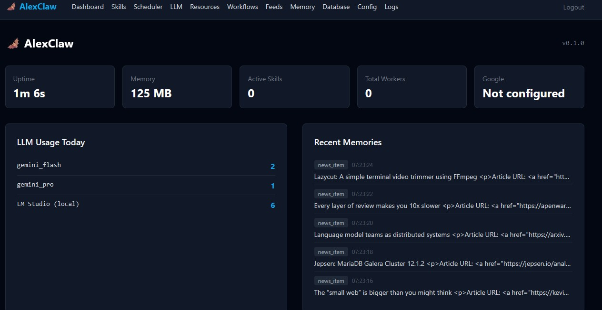
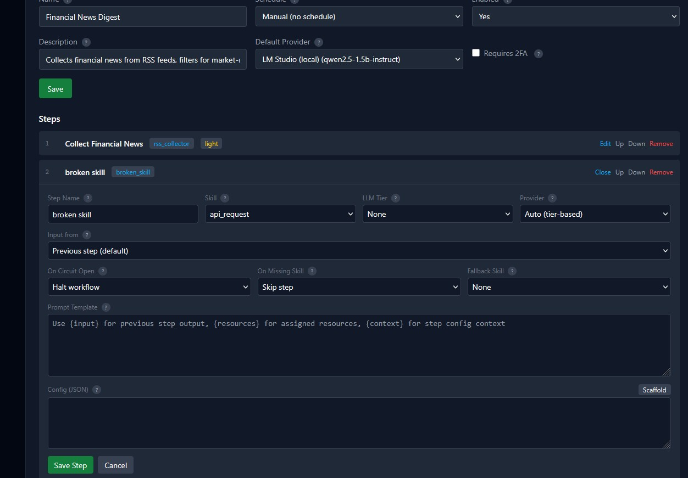
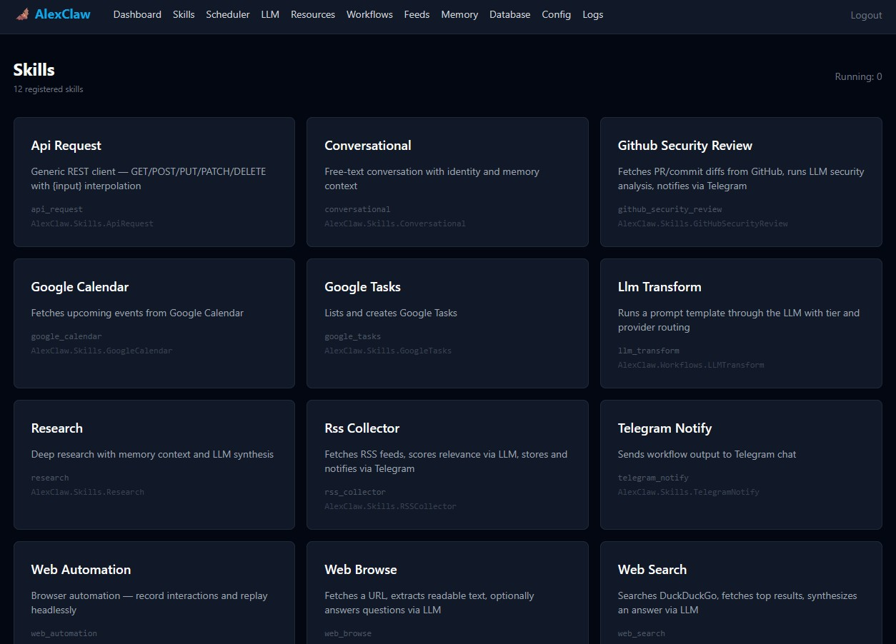
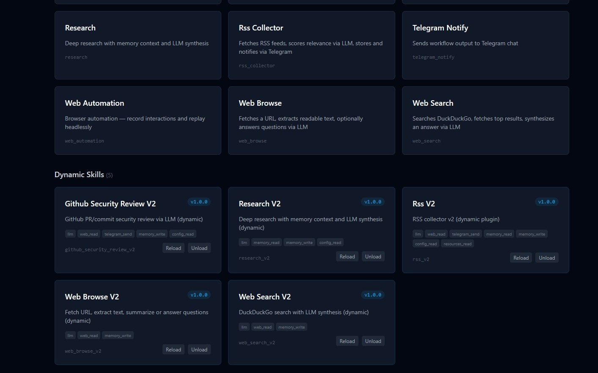
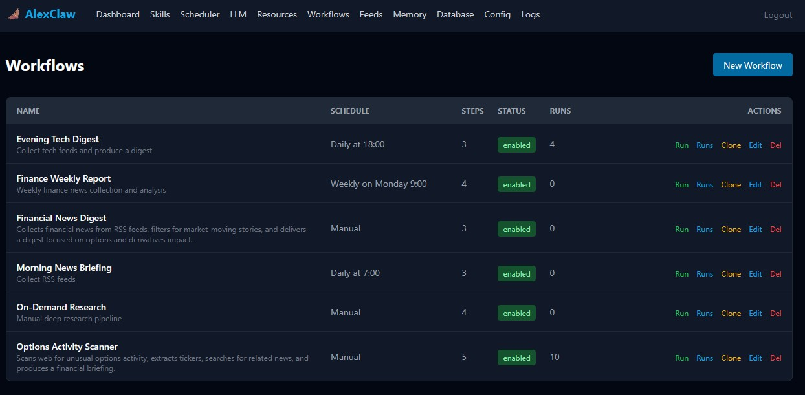

# AlexClaw

[](https://github.com/thatsme/AlexClaw/actions/workflows/ci.yml)

A personal AI agent for a single user, built on Elixir/OTP.

AlexClaw monitors sources (RSS feeds, web pages, GitHub repositories, APIs), stores what it collects in a knowledge base, runs workflows on a schedule, and talks to its owner over Telegram or Discord. Each task is routed to the cheapest configured LLM that meets the task's reasoning tier, local models included. Credentials are kept in a bundled OpenBao, not in the database.

> **Single-user.** AlexClaw has one operator and no multi-user access control. It runs on the operator's own infrastructure.



---

## Features

### Core

- **Multi-Model LLM Router** — Tier-based routing (`light` / `medium` / `heavy` / `local`) with priority-based selection. All providers (cloud and local) are stored in PostgreSQL and managed from the admin UI; their API keys are kept in OpenBao. Tracks daily usage per provider in ETS. Default providers (Gemini, Claude, Ollama, LM Studio) are seeded on first boot; a cloud provider seeded before its API key is set starts disabled and is enabled on the LLM page.
- **Workflow Engine** — Multi-step linear pipelines with conditional branching. Each skill declares its possible outcomes (branches), and the executor routes to different steps based on which branch fires. Execution is sequential — one path per run, no fan-out (a step cannot broadcast to multiple parallel successors). Notify skills pass their input through unchanged, so several delivery steps can follow each other. Per-step resilience controls (circuit breaker, missing skill handling, fallback routing). Routing between steps uses no LLM — deterministic pattern matching. Run history with the branch path taken. **Export/Import** — a workflow can be exported as a JSON file (definition, steps, resources) and imported on another instance; credentials are not exported and are entered again after import. Resources are matched by name+URL or created. Filterable workflow list.
- **Reasoning Loop** — Plan-execute-evaluate cycle. The LLM decomposes a goal into a multi-step plan, invokes whitelisted skills, evaluates results on a 1-5 rubric, and decides whether to continue, adjust the plan, ask the user, or declare done. Default LLM tier is `local` (configurable). A deterministic pre-filter handles obvious decisions without an LLM call. Plan validation rejects malformed steps before execution. Working memory is compressed every 3 iterations. The time budget scales with plan size. The user can pause, resume, steer, abort or override a step while it runs. Every prompt, response, skill call, rubric score and working memory snapshot is persisted. Skill outputs are embedded to pgvector for later sessions. Available from the chat page in Reasoning mode.
- **OTP Circuit Breaker** — Per-skill circuit breaker using GenServer + ETS. After consecutive failures a skill is temporarily disabled (circuit open), then re-tested after a cooldown. State transitions are notified over the chat gateway. Dead letter routing: a workflow step can skip, halt, or fall back to another skill when a circuit is open or a skill is missing.


- **Multi-Gateway (Telegram + Discord)** — Telegram long-polling and a Discord bot over WebSocket. Command routing is deterministic pattern matching — no LLM involved in dispatch. Both gateways can run at once; responses go back to the originating transport. Each gateway answers only its owner: one user, in one chat or channel, set in the admin UI. The Gateway behaviour allows adding transports without changing skills or the Dispatcher.
- **Runtime Configuration** — Settings (prompts, limits, personas, skill options) are stored in PostgreSQL, cached in ETS, and edited at runtime in the admin UI. Secret settings (bot tokens, API keys, OAuth and webhook secrets) are kept in OpenBao. Every change needs the admin session unlocked with a 2FA code. Enabling Discord needs a container restart; most other changes apply at once.
- **API Resource Discovery** — API-type resources are probed on creation. OpenAPI/Swagger specs are looked for at common paths, parsed, and stored in resource metadata. The workflow step editor shows discovered endpoints as a dropdown for pre-filling `api_request` step config. A "Discover" button runs discovery again.
- **Persistent Memory with Semantic Search** — PostgreSQL + pgvector for knowledge storage. Deduplication by URL. Hybrid search combines vector cosine similarity and keyword matching — vector results first, keyword results fill gaps for exact matches. Embeddings are generated asynchronously via the LLM router (Gemini `gemini-embedding-001`, Ollama `nomic-embed-text`, or any OpenAI-compatible endpoint). 768-dimension vectors with an HNSW index. Skills that store knowledge embed it in the background.
- **Knowledge Base RAG** — A separate `knowledge_entries` table for documentation and reference material, kept apart from news/conversation memory. Scraper skills fetch, chunk, and embed documentation from hexdocs.pm, Erlang/OTP source (GitHub), Elixir stdlib source, Learn You Some Erlang, and existing skill code. Chat searches both Knowledge and Memory, with a context source selector.
- **Cron Scheduler** — Quantum-based. Jobs defined in config or DB.
- **Multi-Node BEAM Clustering** — Multiple AlexClaw instances connected via Erlang distribution. Each node runs its own executor; nodes exchange workflow outputs via the `send_to_workflow` and `receive_from_workflow` skills. Nodes are registered on the Cluster page; a node that merely connects with the cookie is audited, not registered. Another node may start only an unprotected workflow whose first step, `receive_from_workflow`, names it — and never one with a privileged step. Node status and per-workflow node assignment are in the admin UI. `docker-compose_swarm.yml` is included for local multi-node testing of clustering; it has no OpenBao, so no credential resolves and no second factor can be set up on it.
- **MCP Server** — Model Context Protocol server at `/mcp`. An MCP client reads AlexClaw's data (knowledge, memory, resources, workflows, runs, config — secrets redacted) as MCP resources and runs enabled workflows that do not require 2FA as `workflow:<name>` tools. It cannot change anything, run a skill on its own, or start a workflow with a privileged step. Bearer key auth, `mcp_restriction` policies, every run audited through the control plane. Built on `anubis_mcp` with Streamable HTTP transport.

### Skills

> **Deprecation notice (v0.3.15):** `web_browse`, `web_search` and `rss_collector` are deprecated and kept for existing workflows; a later release removes them. The composable pattern replaces them: `web_fetch → llm_transform`, `web_search_fetch → llm_transform`, `rss_fetch → llm_score → llm_transform`. See the [v0.3.15 release notes](https://github.com/thatsme/AlexClaw/releases/tag/v0.3.15) for migration examples.



| Skill | Description |
|---|---|
| `web_fetch` | Fetch a URL, return extracted text (no LLM) |
| `web_search_fetch` | Search DuckDuckGo + fetch pages, return raw content (no LLM) |
| `rss_fetch` | Fetch RSS feeds, dedup, filter recent, return JSON items (no LLM) |
| `llm_transform` | Run a prompt template through the LLM (workflow glue step) |
| `llm_score` | Batch-score items for relevance via single LLM call |
| `rss_collector` | Fetch + score + notify all-in-one (**deprecated**, use `rss_fetch → llm_score`) |
| `web_search` | Search + synthesize (**deprecated**, use `web_search_fetch → llm_transform`) |
| `web_browse` | Fetch + summarize (**deprecated**, use `web_fetch → llm_transform`) |
| `research` | Deep research with memory context |
| `conversational` | Free-text LLM conversation |
| `telegram_notify` | Send a Telegram message as a workflow step |
| `discord_notify` | Send workflow output to a Discord channel. Configurable `channel_id` per step — deliver to different channels in the same workflow |
| `api_request` | REST client with API resource discovery — resolves URLs from assigned resources, supports `{base_url}` interpolation. Header values are kept in OpenBao, bound to the host they are sent to |
| `github_security_review` | Fetch a PR or commit diff for review by a following LLM step |
| `google_calendar` | Fetch upcoming Google Calendar events |
| `google_tasks` | Manage Google Tasks lists and items |
| `db_backup` | PostgreSQL backup with gzip compression and rotation to a host-mounted path (privileged) |
| `shell` | Execute allow-listed OS commands for container introspection (privileged) |
| `web_automation` | Browser automation via the headless sidecar (**experimental**, privileged) |
| `coder` | Generation engine behind the Forge page; not usable as a workflow step |
| `send_to_workflow` | Send data to a workflow on another BEAM node |
| `receive_from_workflow` | Gate: accepts remote triggers when placed as step 1, from the nodes it names |
| `hexdocs_scraper` | Scrape hexdocs.pm docs into knowledge base embeddings (dynamic) |
| `erlang_docs_scraper` | Fetch Erlang/OTP docs from GitHub into knowledge base (dynamic) |
| `lyse_scraper` | Scrape Learn You Some Erlang chapters into knowledge base (dynamic) |
| `elixir_source_scraper` | Fetch Elixir stdlib source from GitHub for pattern learning (dynamic) |
| `skill_source_indexer` | Index existing skill source code into the knowledge base (core) |

Privileged skills (`shell`, `coder`, `db_backup`, `web_automation`) run only in a run the scheduler starts, or one the admin UI starts with a 2FA code. A run of a workflow containing one is refused up front from a chat, MCP, a webhook or another node. See [SECURITY.md](SECURITY.md#dynamic-skill-loading).

### Dynamic Skill Loading



Custom skills are loaded at runtime — no code changes, no Docker rebuild, no restart. A skill file uploaded on the Skills page is staged outside the live directory, checked, and compiled into the running VM once a 2FA code approves it.

- **Declared permissions** — Dynamic skills declare permissions and interact through `SkillAPI`, which denies undeclared permissions at runtime. The context-aware `PolicyEngine` evaluates chain depth, capability tokens, and configurable policy rules.
- **Containment** — every dynamic skill may call only an allowlist of pure modules plus `SkillAPI`, checked on its syntax tree at load and again at every boot. A file that reaches `File`, `System`, `Repo`, `Req` or anything else outside the list does not load, and no approval changes that. Through `SkillAPI` a skill can do only what its declared permissions allow. See [SECURITY.md](SECURITY.md#dynamic-skill-loading).
- **External skill detection** — skills that fetch external data declare `external/0`; a skill calling `SkillAPI.http_*` without it is rejected at load.
- **Load-time validation** — Skill source is vetted as a syntax tree before it is compiled: one module per file, in the `AlexClaw.Skills.Dynamic.*` namespace, with a module body restricted to declarations. Nothing in the file executes at load time.
- **Content sanitization** — A 7-layer heuristic sanitizer strips prompt injection payloads from external content before LLM ingestion. It detects hidden HTML/CSS, zero-width unicode steganography, known injection patterns (101 from Garak), and imperative tone anomalies. Patterns are loaded from JSON at runtime and can be updated without recompilation.
- **Capability tokens** — Macaroon-style HMAC-signed tokens attenuate permissions through the call chain. Workflow steps get scoped tokens; cross-skill invocation restricts them further.
- **Process isolation** — Dynamic skills execute in spawned processes via `SafeExecutor`, isolating auth state from the caller.
- **Namespace enforcement** — Module must be `AlexClaw.Skills.Dynamic.*`
- **Integrity verification** — SHA256 checksum stored on load, verified on boot. Tampered files are skipped with a Telegram alert.
- **Persistence** — Dynamic skills survive container restarts (DB + Docker volume)
- **Admin UI** — Upload, reload, and unload skills from the Skills page. Core and dynamic skills are shown separately.
- **2FA enforced** — loading and reloading a skill each take a TOTP code typed on the Skills page, for that load alone; the approval screen lists the skill's permissions and flags the risky ones. Unloading needs the page to be unlocked (a 2FA elevation). None of it is possible from a chat: `/skill` only answers that skill management is in the admin UI.
- **Version bump enforcement** — Loading a skill that's already loaded with the same version is rejected. Bump `version/0` or use reload to force.
- **Cross-skill invocation** — Dynamic skills can call other skills through `SkillAPI.run_skill/3`, except the four privileged ones (`shell`, `coder`, `db_backup`, `web_automation`)
- **Conditional branching** — Dynamic skills can declare `routes/0` (e.g. `[:on_results, :on_empty, :on_error]`) and return triple tuples `{:ok, result, :branch_name}` for workflow routing. Routes are persisted in the database on load and cleaned up on unload — same behavior as core skills.

#### Permissions

| Permission | Grants access to |
|---|---|
| `:llm` | LLM completion, system prompt |
| `:web_read` | HTTP GET, POST, and arbitrary requests |
| `:gateway_send` | Send Markdown or HTML messages to the configured chat (`:telegram_send` is accepted for older skills) |
| `:memory_read` | Search, check existence, list recent memories |
| `:memory_write` | Store new memory entries |
| `:config_read` | Read runtime config values — settings marked sensitive are refused |
| `:resources_read` | List and fetch resources — embedded credentials are redacted |
| `:knowledge_read` | Search and check existence in knowledge base |
| `:knowledge_write` | Store knowledge entries |
| `:skill_invoke` | Call other skills by name — excluding `shell`, `coder`, `db_backup` and `web_automation` |
| `:workflow_read` | Read the result of a workflow run |

#### Getting Started

See [`test/fixtures/skills/skill_template.ex`](test/fixtures/skills/skill_template.ex) for a documented template and the [Skill API Reference](docs/skills/skill-api.md) for every function. Other files in that directory are test fixtures; some predate containment and do not load on 0.4.0 as they are.

### GitHub Security Review

AlexClaw can fetch pull requests and commits for a security review:

- `github_security_review` fetches a PR or commit diff (truncated at 24 KB); the analysis is a following `llm_transform` step, whose prompt sets the report's shape
- Webhook: `POST /webhooks/github` (HMAC-SHA256) starts the workflow named in `github.review_workflow` for an opened, synchronised or reopened PR, or a push to a watched branch (`github.watched_branches`). With no workflow named, nothing runs and the audit log records it. A protected workflow, or one with a privileged step, is refused.
- From a chat: `/github pr owner/repo 42`, `/github commit owner/repo <sha>`

### Observability

- **Health endpoint** — `GET /health` (unauthenticated) returns `{"status":"ok","version":"...","db":"connected","mcp":"running"}` for load balancers and Docker healthchecks. Returns HTTP 503 when the database is unreachable.
- **Metrics endpoint** — `GET /metrics` (authenticated) returns a JSON payload with system stats (uptime, memory, BEAM processes), LLM provider usage, workflow run counts, skill and circuit breaker states, MCP status and tool count, log severity counts, and knowledge/memory entry counts.

### Database Backups

Automated PostgreSQL backups via the `db_backup` core skill. Backups are gzip-compressed `pg_dump` files saved to a **host-mounted directory** — not inside the container filesystem, so they survive container recreation and volume deletion.

- **Host bind mount** — backups are written to `/app/backups` inside the container, mapped to a host directory via `docker-compose.yml` (`${BACKUP_DIR:-./backups}:/app/backups`). Set `BACKUP_DIR` in `.env` to change the host path (e.g. `BACKUP_DIR=D:/Backups/alexclaw` on Windows, `BACKUP_DIR=/mnt/backups/alexclaw` on Linux).
- **Mount verification** — the skill checks that `/app/backups` is a real bind mount (via `/proc/mounts` and device ID comparison). If the directory is on the container's overlay filesystem, the backup is refused with an error saying so.
- **Rotation** — keeps the last N backups (configurable via `backup.max_files`, default 7). Oldest files are deleted.
- **Workflow integration** — create a workflow with `db_backup` as a step, add a `telegram_notify` or `discord_notify` step for confirmation, and schedule it via cron (e.g. daily at 03:00: `0 3 * * *`). Enable backups from Admin > Config (`backup.enabled = true`). `db_backup` is a privileged step: a scheduled run needs nothing more, a run started from the admin UI asks for a 2FA code, and a run started from a chat, MCP, a webhook or another node is refused.
- **Credentials are not in these backups.** They are in OpenBao, backed up separately with `make backup-openbao REASON=<reason>`, into a directory AlexClaw does not mount. The unseal key and the recovery key are not in that snapshot either and are kept offline. See [OpenBao](docs/architecture/openbao.md#backing-up-and-restoring-openbao).

### Security

- **Session-based authentication** — all routes except `/login` and `/health` require an authenticated session
- **Two-Factor Authentication (2FA)** — TOTP-based, held by OpenBao's TOTP engine. Set up and turned off in the admin UI (Services → Two-factor authentication); the secret never travels over a chat. Every change to what the agent does (settings, workflows, resources, providers, policies, skills, cluster nodes) needs a 2FA elevation of the admin session; loading a skill, restoring the database, running a workflow marked `Requires 2FA` or one with a privileged step each need a code of their own. A code typed into a chat approves a protected workflow run and nothing else. Everything fails closed when 2FA is not configured. See [SECURITY.md](SECURITY.md#control-plane-elevation).
- **Built-in login rate limiting** — ETS-based, configurable max attempts and block duration, adjustable at runtime without restart
- **HMAC-SHA256 webhook verification** — GitHub webhook endpoint uses `Plug.Crypto.secure_compare` for timing-safe signature validation
- **Secrets in OpenBao** — bot tokens, API keys, OAuth secrets, LLM provider keys, step and resource credentials live in a bundled OpenBao; the database holds references. Each secret is bound to the host it is sent to, resolved at use and audited; skills see a placeholder, never the value. See [SECURITY.md](SECURITY.md#secrets-in-openbao).
- **No secret on screen** — a secret field shows when it was set and an empty input; a new value replaces it, an empty one keeps it.
- **One door for privileged actions** — the admin UI, chat gateways, MCP, the GitHub webhook, other cluster nodes and skills all ask one control plane, which checks the entry point and the proof the action needs and audits every attempt, allowed or refused. A chat or MCP client operates the agent (runs workflows, reads data); only the admin UI changes it.
- **Agent authorization layer** — Context-aware PolicyEngine with HMAC capability tokens, chain-depth enforcement, process isolation for dynamic skills, configurable policy rules (rate_limit, time_window, chain_restriction, permission_override, mcp_restriction), and persistent audit logging
- **MCP Bearer token auth** — MCP endpoint requires `Authorization: Bearer <token>`. The key is generated by AlexClaw and shown once; only an OpenBao HMAC of it is stored, compared in constant time. Policy-based tool restrictions allow blocking specific tools for MCP clients. Sensitive config values are redacted in MCP resource responses
- **Shell step security** — disabled by default; a privileged step (scheduled runs, or admin-UI runs with a 2FA code, only); allowlist with word-boundary check plus an exact-match list; blocklist for shell metacharacters; no shell interpretation (`System.cmd/3` with args as a list); configurable timeout and output truncation. Allowlists come from configuration only — a workflow step supplies a command, never the rules it is checked against.

---

## Architecture

```
Telegram <──> Gateway.Telegram ──┐
Discord  <──> Gateway.Discord  ──┴──> Dispatcher ──┐
MCP Client  <──> MCP.Server ───────────────────────┤
GitHub Webhook ──> GitHubWebhookController ────────┼──> ControlPlane.perform ──> Workflows.Executor / Skills
Other node  ──> Cluster.Manager ───────────────────┤        (audited)
Admin UI (LiveView) ───────────────────────────────┘
                                │
                           LLM Router
                    (Gemini / Anthropic / Ollama / LM Studio)
                                │
                    ┌───────────┴───────────┐
                 Memory                  Config
          (pgvector + embeddings)    (DB + ETS + PubSub)
           ↑ semantic search ↑        secrets in OpenBao

Scheduler (Quantum) ──> Workflows.Executor ──┬──> CircuitBreaker ──> Skills ──> Branch Router
                                             └──> Fallback / Skip / Halt    └──> Next Step
```

Every skill runs as a supervised OTP process; a crash is contained. The circuit breaker wraps each skill — skills have no awareness of it. The `Dispatcher` is deterministic pattern matching — no LLM tokens are spent on routing.

See [ALEXCLAW_ARCHITECTURE.md](ALEXCLAW_ARCHITECTURE.md) for the full design document.

---

## Quick Start

```bash
git clone https://github.com/thatsme/AlexClaw.git
cd AlexClaw
cp .env.example .env
# In .env: DATABASE_OWNER_PASSWORD, DATABASE_PASSWORD, SECRET_KEY_BASE,
# ADMIN_PASSWORD and CLUSTER_COOKIE (INSTALLATION.md shows how to generate them).
mkdir -p openbao/unseal
head -c 32 /dev/urandom > openbao/unseal/key && chmod 0440 openbao/unseal/key
docker compose up -d
docker compose run --rm openbao-init   # once: prints the recovery key
```

The first `docker compose up -d` leaves `openbao-init` exited with "OpenBao is not initialised": the second command initialises it, at the terminal. It prints OpenBao's recovery key once and waits until `SAVED` is typed. Store the recovery key and a copy of the unseal key file offline: losing the unseal key file loses every secret.

Then:

1. Open [http://localhost:5001](http://localhost:5001) and log in with `ADMIN_PASSWORD`.
2. Set up 2FA under **Services → Two-factor authentication** and store the recovery codes it shows. Until then the configuration is read-only.
3. Unlock editing with a code and, on the Config page, enter the Telegram bot token (`telegram.bot_token`), `telegram.chat_id`, `telegram.owner_user_id` and an LLM API key. The bot answers only that user, in that chat.
4. On the LLM page, enable the providers that use the key.
5. Send `/ping` to the bot to verify.

Setup details are in **[INSTALLATION.md](INSTALLATION.md)**; OpenBao's first start in [OpenBao](docs/architecture/openbao.md#first-start).

---

## Configuration

All configuration is managed at runtime through the admin UI (`/config`). On first boot, some values are seeded from environment variables; after that, changes are made in the UI. Every change needs the admin session unlocked with a 2FA code; until 2FA is set up, the configuration is read-only.

### Minimum required environment variables

| Variable | Description |
|---|---|
| `DATABASE_OWNER_PASSWORD` | Password of the database owner role (migrations only) |
| `DATABASE_PASSWORD` | Password of the application's database role |
| `SECRET_KEY_BASE` | Phoenix session secret, at least 64 bytes (`openssl rand -base64 48`) |
| `ADMIN_PASSWORD` | Web interface password; the first login stores its hash, after which the variable is ignored |
| `CLUSTER_COOKIE` | Erlang distribution cookie (`openssl rand -base64 32`); no default |

Optional:

| Variable | Description |
|---|---|
| `TELEGRAM_CHAT_ID` | Seeds `telegram.chat_id` at the first start; it can be set on the Config page instead |
| `OPENBAO_UNSEAL_DIR` | Host directory holding OpenBao's unseal key (default `./openbao/unseal`) |
| `OPENBAO_BACKUP_DIR` | Host directory for OpenBao snapshots (default `~/backups` with `make backup-openbao`); never `BACKUP_DIR` or a directory inside it |

### LLM providers (at least one required)

The Gemini (free tier available) and Anthropic API keys are entered on the
Config page after the first start and kept in OpenBao; the providers that use
them are then enabled on the LLM page. Local models are enabled here:

| Variable | Description |
|---|---|
| `OLLAMA_ENABLED=true` + `OLLAMA_HOST` | Local Ollama instance |
| `LMSTUDIO_ENABLED=true` + `LMSTUDIO_HOST` | Local LM Studio instance |

### Discord (optional)

Discord is configured in **Admin > Config**, not by environment variable — set `discord.enabled`, `discord.bot_token`, `discord.channel_id` and `discord.owner_user_id` (the owner's Discord user id: only that user's messages in that channel are answered), then restart the container. Telegram works the same way with `telegram.chat_id` and `telegram.owner_user_id`. With an owner user id blank, that gateway answers nothing.

All other settings (GitHub tokens, webhook secrets, LLM limits, prompts, skill config) are managed at runtime through the Config page after first boot.

See `.env.example` for the full list of bootstrap variables.

---

## LLM Tier System

| Tier | Default providers | Typical use |
|---|---|---|
| `light` | Gemini Flash, Claude Haiku | RSS scoring, classification, simple tasks |
| `medium` | Gemini Pro, Claude Sonnet | Summarization, research, security review |
| `heavy` | Claude Opus | Deep reasoning (explicit only) |
| `local` | LM Studio, Ollama | Privacy-sensitive content, offline use, zero cost |

All providers live in the database and can be added, removed, or reconfigured from the admin UI. The defaults above are seeded on first boot. The router selects by priority within each tier (lower priority number = preferred), tracks daily usage, and falls back to the next available provider when one times out, refuses the connection or answers with a server error. A fully local deployment with no API keys is supported — enable a local provider and all tiers will fall back to it.

**Per-skill defaults:** each skill has a configurable default tier (e.g. `skill.research.tier`), set on the Config page. In a chat, `--tier` (and `--provider`) with a query overrides the default for that call only; `--tier` without a query answers that defaults are set on the Config page.

---

## Telegram/Discord Commands

| Command | Description |
|---|---|
| `/ping` | Check if the bot is alive |
| `/status` | System status (uptime, memory, active skills) |
| `/skills` | List registered skills (core + dynamic) |
| `/llm` | Show LLM provider status |
| `/workflows` | List all workflows with status and ID |
| `/run <id or name>` | Run a workflow; one that requires 2FA asks for a code in the chat. A workflow with a privileged step is refused |
| `/runs` | Show active runs |
| `/cancel <run_id>` | Cancel a running workflow |
| `/rate <run_id> [step] +\|-` | View or rate a run's step outcomes |
| `/research <query>` | Deep research with memory context (`--tier`/`--provider` override for this call) |
| `/search <query>` | Web search and synthesis |
| `/web <url> [question]` | Fetch and summarize a URL, or answer a question about it |
| `/github pr <owner/repo> [number]` | Fetch a PR diff for review |
| `/github commit <owner/repo> <sha>` | Fetch a commit diff for review |
| `/tasks`, `/tasklists`, `/task add <title>` | Google Tasks |
| `/help` | Show all commands |
| _six digits_ | Answer a pending 2FA challenge for a protected run |
| _any text_ | Free-text conversation |

A chat operates AlexClaw; it does not change it. Skill management, skill generation, recordings and replays, 2FA set-up, the Google connection and default tiers are done in the admin UI, and the old commands for them (`/skill`, `/coder`, `/shell`, `/record`, `/replay`, `/automate`, `/setup 2fa`, `/confirm 2fa`, `/disable 2fa`, `/connect google`) only answer where. Only the owner is answered — see Discord above.

---

## Admin UI



| Page | Description |
|---|---|
| Dashboard | System status, recent activity |
| Chat | Conversational chat with memory context — pick any provider (cloud or local) |
| Forge | Skill generation from a goal (pre-alpha): contained code within the unattended permissions loads at once; more permissions wait for a 2FA code; calls outside the allowlist never load |
| Skills | Core and dynamic skills — upload, reload, unload |
| Scheduler | Cron jobs and scheduled workflows |
| LLM | Providers, their status and usage |
| Workflows | Create/edit/run pipelines, export/import as JSON, run history. Running a protected workflow, or one with a privileged step, asks for a 2FA code |
| Resources | Shared resources for workflows (RSS feeds, websites, APIs, automations); recordings and replays of web automations |
| Memory | Browse and search stored knowledge |
| Database | Table browser, backup download, data export, and restore (restore takes a 2FA code). Exports carry no credentials, no secret catalogue, no policies and no admin identity; a restore keeps this installation's |
| Services | External service status — connectivity checks for DB, Google, Telegram, Discord, 2FA, Ollama, LM Studio, GitHub, Web Automator. 2FA set-up, and the Google connection |
| Config | Runtime configuration editor |
| Logs | Real-time log viewer with severity filtering |
| Policies | Authorization policy rules, audit log viewer |
| Cluster | Registered nodes, status and connection |

Every change made from these pages requires the page to be unlocked with a 2FA code (a 15-minute elevation of that session).

---

## Project Structure

```
lib/
  alex_claw/
    config/          # Runtime config (DB + ETS + PubSub broadcast), secret settings
    control_plane/   # The one door: action catalogue, contexts, effects (ControlPlane.perform/3)
    secrets/         # Secret references, ownership, masking
    vault/           # OpenBao client supervision
    upgrade/         # One-time 0.3.x → 0.4.0 carry-over
    knowledge/       # Knowledge base entry schema (pgvector)
    llm/             # LLM router, usage tracker, provider schema
    memory/          # Memory entry schema
    auth/            # Authentication and authorization (second factor, elevation, PolicyEngine, CapabilityToken, SafeExecutor, AuditLog)
    skills/          # Core skill modules, SkillAPI, DynamicSkill schema, CircuitBreaker
    workflows/       # Executor, scheduler sync, SkillRegistry (GenServer+ETS), step/run schemas
    dispatcher.ex    # Deterministic message routing
    gateway.ex       # Gateway facade (Telegram, Discord)
    identity.ex      # Agent persona and system prompts
    llm.ex           # Multi-model router
    memory.ex        # Knowledge store
    rate_limiter.ex  # ETS-based login rate limiting
    scheduler.ex     # Quantum cron scheduler
    vault.ex         # OpenBao client
  alex_claw_web/
    controllers/     # Auth, database backup and export, GitHub webhook, Google OAuth callback
    live/admin_live/ # LiveView admin pages
    plugs/           # RequireAuth, RateLimit, RawBodyReader, MCP auth
openbao/             # OpenBao configuration, init and backup scripts
priv/repo/
  migrations/        # All DB migrations
  seeds/             # Example workflow seeds
```

---

## Known Limitations

- **Semantic search requires an embedding provider.** Vector search works when at least one embedding-capable provider is configured (Gemini, Ollama, or OpenAI-compatible). Without one, memory falls back to keyword search. Configure via `embedding.provider` and `embedding.model` in the admin UI.
- **Single-user only.** There is no multi-user access control. The authentication model assumes one trusted operator.
- **Credentials in OpenBao.** Every credential — settings, LLM providers, workflow steps, resources — is kept in OpenBao, bound to the host it is sent to; the database holds references ([SECURITY.md](SECURITY.md#secrets-in-openbao)). OpenBao's unseal key file and recovery key are kept outside it and must be stored offline: losing the unseal key loses every secret. Changing `SECRET_KEY_BASE` ends every login and nothing else ([Rotating SECRET_KEY_BASE](docs/deployment/rotate-secret-key-base.md)).
- **Web Automator is experimental.** The browser automation sidecar (`web_automation` skill) is under heavy development. APIs, config format, and recording workflow may change without notice.
- **Forge is pre-alpha.** See below.

---

## Forge — Pre-Alpha

Forge generates dynamic skills from natural-language goals using RAG context from the knowledge base. Code that stays inside the contained set and the unattended permissions loads at once; code asking for more permissions waits for a 2FA code; code calling outside the allowlist never loads. The provider is chosen on the page — a cloud provider puts a third party in the loop for code compiled into the running VM. APIs will change without notice.

---

## Security

See [SECURITY.md](SECURITY.md) for the full security policy and deployment hardening guidance.

---

## Contributing

See [CONTRIBUTING.md](CONTRIBUTING.md) for contribution guidelines and [CLA.md](CLA.md) for the Contributor License Agreement.

---

## License

Copyright 2026 Alessio Battistutta — Licensed under the Apache License, Version 2.0. See [LICENSE](LICENSE) for details.
